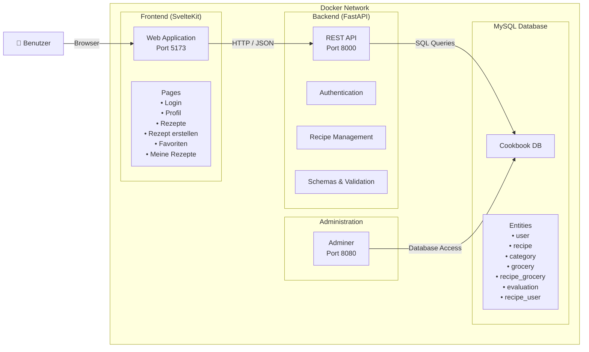

# Kurzbeschreibung
Das Kochbuch ist eine webbasierte Rezeptverwaltung, die das Erstellen, Organisieren und Verwalten von Kochrezepten ermöglicht. Benutzer können eigene Rezepte anlegen, bearbeiten und bewerten sowie ihre Lieblingsrezepte als Favoriten speichern.

Die Anwendung besteht aus einem SvelteKit-Frontend, einem FastAPI-Backend und einer MySQL-Datenbank. Die Kommunikation erfolgt über eine REST-API. Für die Verwaltung der Datenbank steht zusätzlich Adminer zur Verfügung.

Funktionen
- Benutzerregistrierung und Login
- Erstellen, Bearbeiten und Löschen von Rezepten
- Verwaltung von Zutaten und Kategorien
- Bewertung von Rezepten durch Benutzer
- Speichern von Rezepten als Favoriten
- Übersicht über eigene Rezepte
- Responsive Weboberfläche
- Technologien
- Frontend: SvelteKit
- Backend: FastAPI (Python)
- Datenbank: MySQL 8.4
- Containerisierung: Docker & Docker Compose
- Datenbankverwaltung: Adminer

## Setup Anleitung

```bash
# 1. .env aus Vorlage erstellen und Werte anpassen
cp .env.example .env

# 2. SECRET_KEY generieren (für JWT) – z.B. mit:
openssl rand -hex 32
# Den Output in die `.env`-Datei als `SECRET_KEY` eintragen.

# 3. Alle Services bauen und starten
docker compose up -d --build

# 4. Fertig!
#    Frontend:  http://localhost:5173
#    Backend:   http://localhost:8000
#    API-Docs:  http://localhost:8000/docs
```

## Dateistruktur

```
projekt-template/
├── backend/
│   ├── main.py          # FastAPI-App (Endpoints)
│   ├── auth.py          # JWT + Argon2 Passwort-Hashing
│   ├── database.py      # SQLAlchemy Engine + Session
│   ├── models.py        # ORM-Modelle (User + Tabellen)
│   ├── schemas.py       # Pydantic-Schemas (Request/Response)
│   ├── requirements.txt # Python-Abhängigkeiten
│   └── Dockerfile       # Bauanleitung für Backend-Container
├── frontend/
│   ├── src/
│   │   ├── lib/api.ts                          # API-Hilfsfunktionen (login, fetch...)
│   │   └── routes/
│   │   |   ├── +page.svelte                    # Startseite
│   │   |   ├── +layout.svelte                  # Sidebar
│   │   |   ├── favoriten/+page.svelte          # Favoriten
│   │   |   ├── login/+page.svelte              # Login Maske
│   │   |   ├── meine-rezepte/+page.svelte      # Eigene Rezepte
│   │   |   ├── profil/+page.svelte             # Profil angemeldeter User
│   │   |   ├── rezepte-neu/+page.svelte        # Rezepte hinzufügen
│   │   |   └── rezepte/+page.svelte            # Alle Rezepte
│   │   |   |   └── [id]/+page.svelte           # Rezept anzeigen
│   │   |   |   |   └── bearbeiten/+page.svelte # Rezepte bearbeiten
│   ├── package.json                            # NodeJS-Abhängigkeiten
│   └── Dockerfile                              # Bauanleitung für Frontend-Container
├── docker-compose.yml                          # Orchestrierung aller Container
├── .env.example                                # Vorlage für Umgebungsvariablen
└── .gitignore                                  # Git-Ignore-Datei
```

# Mermaid 
